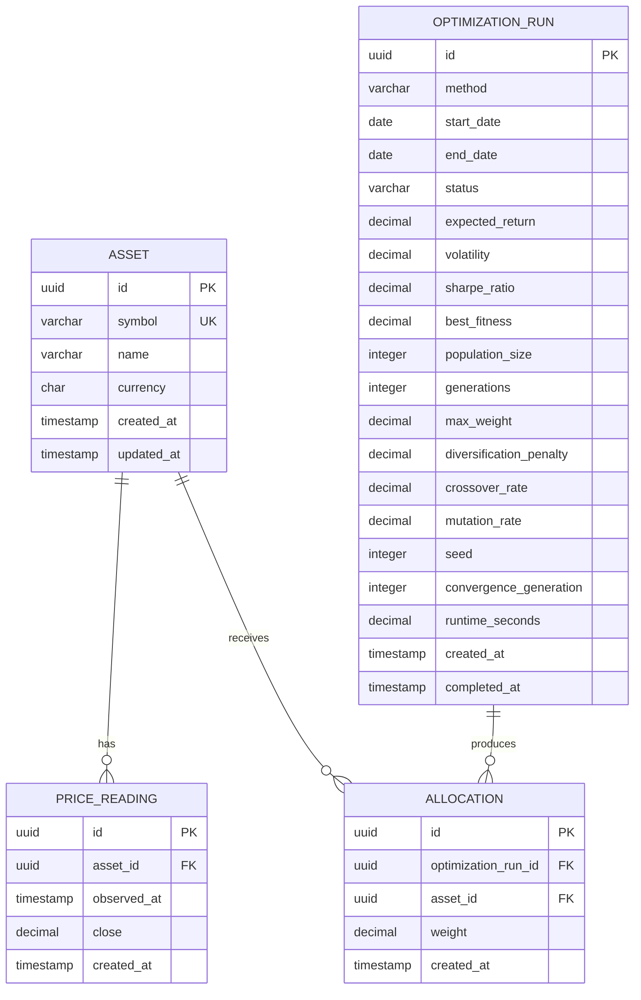

# Portfolio Optimization Domain ERD v0

## Purpose

This document describes the initial relational design for portfolio
optimization data.

## Relationships

- One Asset can have zero or more PriceReadings.
- One OptimizationRun can produce multiple Allocations.
- One Asset can appear in multiple OptimizationRuns.
- Allocation connects an Asset to an OptimizationRun.

## Constraints

### Asset

- `id` is the primary key.
- `symbol` must be unique.
- `symbol`, `name`, and `currency` cannot be empty.
- `symbol` and `currency` are stored in uppercase.

### PriceReading

- `id` is the primary key.
- `asset_id` references `Asset.id`.
- `close` must be greater than zero.
- The combination of `asset_id` and `observed_at` must be unique.

### OptimizationRun

- `id` is the primary key.
- `start_date` must not be later than `end_date`.
- Current persisted status is `completed`.
- Current optimization method is `SGA`.
- Algorithm parameters and runtime metrics are stored for reproducibility.

### Allocation

- `id` is the primary key.
- `optimization_run_id` references `OptimizationRun.id`.
- `asset_id` references `Asset.id`.
- The combination of `optimization_run_id` and `asset_id` must be unique.
- `weight` must be between zero and one when short selling is disabled.
- The allocation weights of a completed optimization must total one.

## Transaction boundaries

The following operations must be atomic:

1. Importing a batch of PriceReadings.
2. Saving all Allocations for an OptimizationRun.
3. Saving Allocations and marking an OptimizationRun as completed.

A completed OptimizationRun must never contain incomplete allocations.
