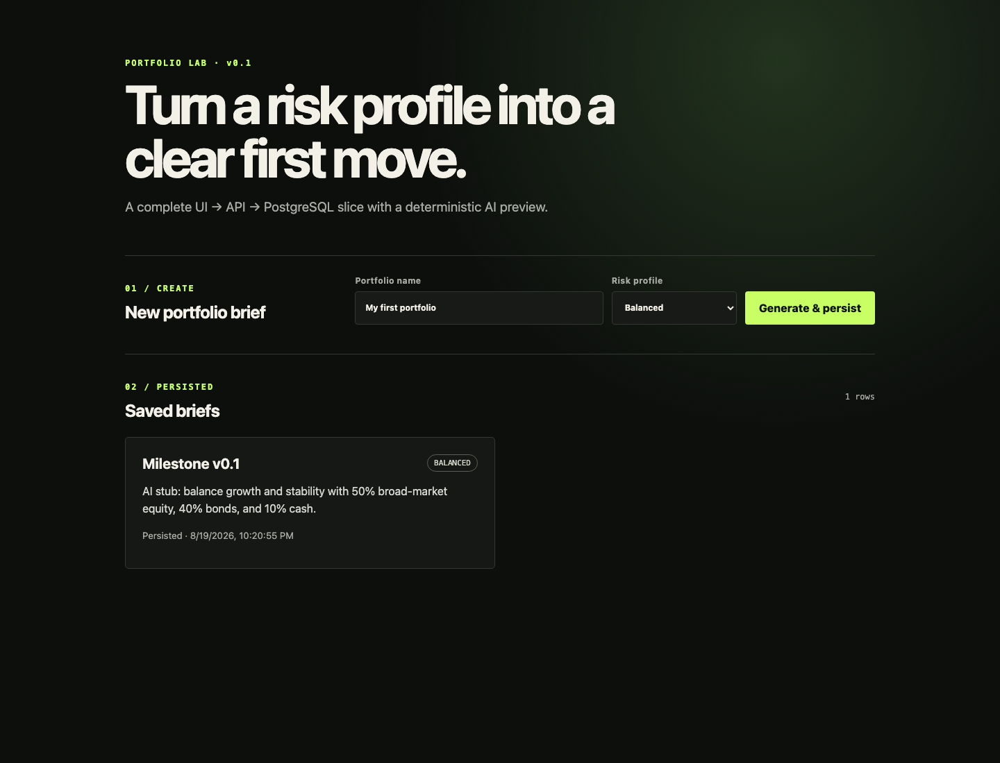

# Milestone v0.1 vertical slice

Delivered on 2026-08-19.

## Demo

The first slice lets a user name a portfolio and choose a risk profile. The
Next.js page performs a typed `POST /briefs`, FastAPI creates a deterministic
AI-stub summary, and the SQL repository inserts the complete result into
PostgreSQL. The page updates its local component state immediately. On a fresh
page/API run, typed `GET /briefs` reads the persisted rows back.



## Run from a clean checkout

```bash
cp .env.example .env
docker compose up -d postgres
.venv/bin/alembic upgrade head
.venv/bin/uvicorn apps.api.main:app --reload
```

In a second terminal:

```bash
cd apps/web
cp .env.example .env.local
npm install
npm run dev
```

Open <http://127.0.0.1:3000>, create a brief, stop and restart both application
processes, then open the page again. The saved row and identical AI-stub text
remain because PostgreSQL, rather than process memory, owns this slice's state.

## Acceptance evidence

- API contract is typed by Pydantic; web requests/responses are typed in
  `apps/web/lib/api.ts`.
- The page explicitly models loading, idle, saving, error, form, and persisted
  collection state.
- `tests/test_api_briefs.py` proves create/read across two fresh HTTP clients
  and proves deterministic output for the same risk profile.
- Full Python suite: 140 passed.
- Web checks: `npm run typecheck` and `npm run build` passed.
- Dependency audit: 0 vulnerabilities.
- Local runtime smoke test created a row, restarted the API process, and read
  the same UUID and AI-stub response back before capturing the screenshot.

## Retrospective

**Went well:** Reusing the domain/service/repository boundaries kept the UI and
AI provider replaceable. A fixed risk-to-summary map makes the demo and tests
repeatable. Request-scoped sessions give commit/rollback behavior without
leaking database concerns into the page.

**Learned:** The pre-existing production endpoints still use in-memory
repositories; switching all of them at once would have made this milestone too
broad. A narrow `portfolio_briefs` slice proves the integration before that
migration.

**Next:** Move Assets, PriceReadings, and OptimizationRuns to SQL repositories;
add browser-level interaction tests; replace the stub behind the same service
boundary only after prompt/version/evaluation requirements are defined.
